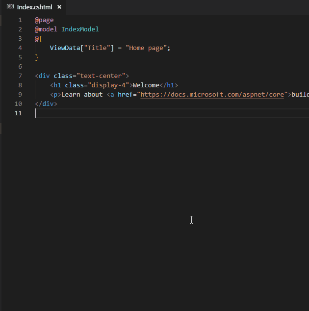
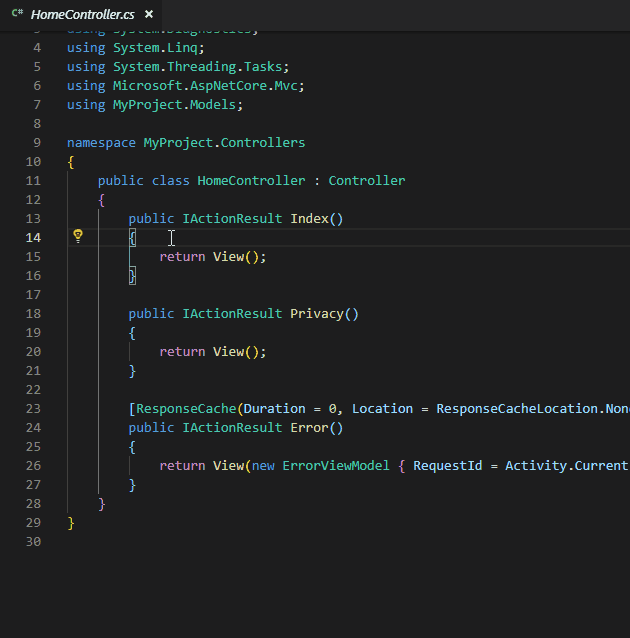
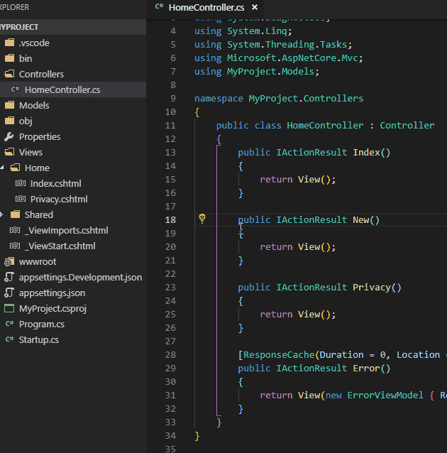

# ASP.NET Core Switcher

Switch between Page and it's PageModel using:
- Keybindings: `alt + o`
- Editor context menu: `Go to Page`, `Go to PageModel`
- Command palette: `Go to Page`, `Go to PageModel`

Switch between View and Controller using:
- Keybindings: `alt + i`
- Editor context menu: `Go to Controller`, `Go to View`
- Command palette: `Go to Controller`

Create View for Action using:
- Keybindings: `alt + p`
- Editor context menu: `Add View...`

